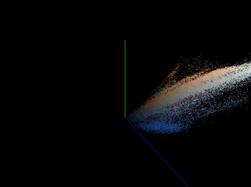

# Image RGB Visualizer

A simple OpenGL program that I wrote to help students visualize the RGB colorspace. Students were learning about K-Means clustering and were having a hard time understanding how the algorithm worked with images. RGB colors are mapped to XYZ axes.

To compile: `make`
This assumes that there is a pic directory one level above

To run: `./rgbvis [IMAGEFILENAME]

